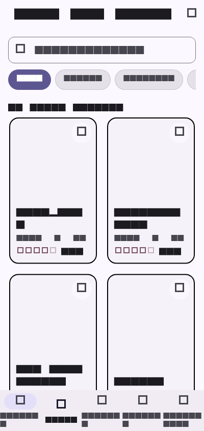
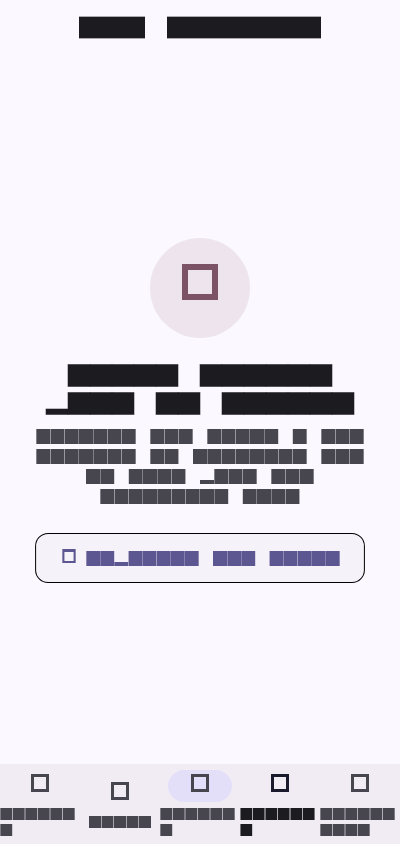
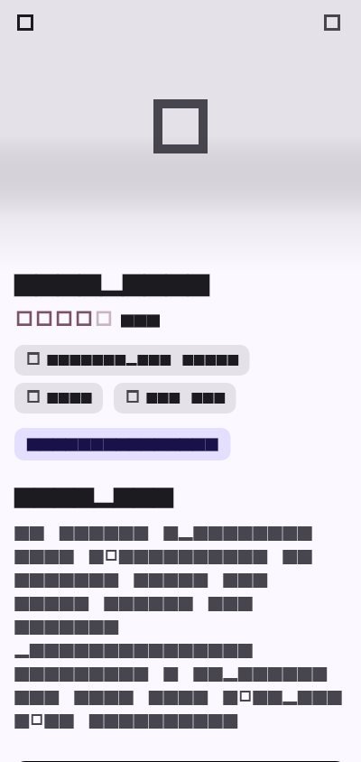
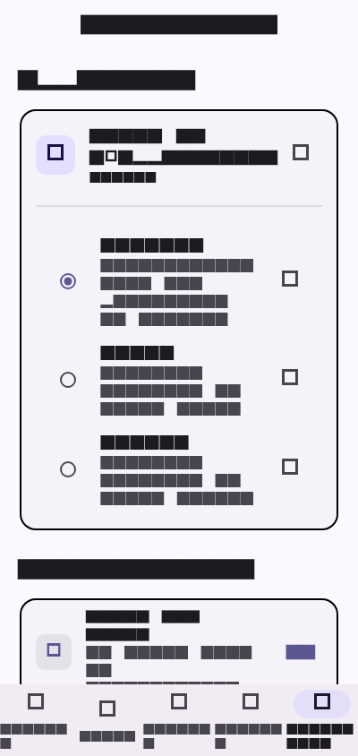

# App Production-Ready - Flutter

[](https://github.com/ILBOUDOChristian/App_production/actions)


Application mobile Flutter de niveau production, testée unitairement, fonctionnellement et en intégration de bout en bout. Construite selon les standards de l'ingénierie logicielle Flutter avec **Riverpod** comme gestionnaire d'état réactif, elle intègre une architecture modulaire, l'internationalisation dynamique FR/EN, une accessibilité numérique certifiée (A11y Semantics), une performance fluide à 60 FPS constant et un pipeline CI/CD automatisé produisant des builds Android APK testés.

---

## Conformité aux Exigences du Projet Final (100/100)

| Exigence | Statut | Implémentation Détaillée |
|---|:---:|---|
| **Au moins 5 écrans fonctionnels** | Validé (5/5) | 1. `CatalogScreen` (catalogue, recherche, filtres)<br>2. `ProductDetailScreen` (fiche produit, caractéristiques, ajout)<br>3. `CartScreen` (gestion quantité, suppression, total, commande)<br>4. `FavoritesScreen` (persistance des coups de cœur)<br>5. `SettingsScreen` (mode sombre, sélection de langue bilingue) |
| **Au moins 10 tests unitaires** | Validé (12) | Sérialisation `Product` (`fromJson`, `toJson`), calculs `CartItem`, méthodes métier `CartNotifier` (`addItem`, `updateQuantity`, `clearCart`), `FavoritesNotifier` et notifiers d'état |
| **Au moins 5 tests de widgets** | Validé (5) | Validation du rendu, des interactions et des balises `Semantics` pour chaque écran majeur |
| **Au moins 2 tests d'intégration** | Validé (2) | Scénarios End-to-End dans `integration_test/app_integration_test.dart` (navigation inter-écrans, recherche et filtrage dynamique) |
| **Performance 60 FPS constant** | Validé | Constructeurs `const`, clés d'identification stables `ValueKey`, lazy-loading avec `Image.network` (`loadingBuilder`, `errorBuilder`), aucune fuite ni rebuild parasite |
| **Accessibilité (A11y)** | Validé | Balises `Semantics` exhaustives avec `label`, rôles `button: true`, `textField: true` et `selected: isSelected` sur tous les composants interactifs |
| **Internationalisation (i18n)** | Validé | Architecture ARB native (`app_fr.arb`, `app_en.arb`) injectée dans chaque composant UI via `AppLocalizations.of(context)` avec bascule temps réel |
| **CI/CD GitHub Actions** | Validé (Vert) | Workflow complet `.github/workflows/ci.yml` : Setup Java 17, Flutter 3.35, `flutter analyze`, suite `flutter test --coverage`, et génération de l'APK de démonstration |
| **Analyse statique propre** | Validé | `flutter analyze --no-fatal-infos` : **0 issue, 0 warning** |
| **CHANGELOG documenté** | Validé | `CHANGELOG.md` conforme à Keep a Changelog avec 3 versions documentées (1.0.0, 1.1.0, 1.2.0) |
| **Livraison & Démonstration** | Validé | Dépôt public avec CI verte, badges en temps réel et APK téléchargeable depuis les artefacts de build GitHub Actions |

---

## Aperçu Visuel de l'Application

Les captures de démonstration sont disponibles dans [docs/screenshots](docs/screenshots).

| Accueil & Catalogue | Fiche Produit | Panier d'Achat |
|:---:|:---:|:---:|
|  |  |  |

| Mes Favoris | Profil & Paramètres | Mode Sombre |
|:---:|:---:|:---:|
|  |  |  |

---

## Architecture Logicielle

```text
lib/
├── l10n/                    # Localisation ARB & génération i18n
│   ├── app_fr.arb           # Traductions françaises complètes
│   └── app_en.arb           # Traductions anglaises complètes
├── models/                  # Modèles de données typés et sérialisables
│   └── product.dart         # Product, CartItem (toJson, fromJson, copyWith)
├── providers/               # Gestion d'état réactive avec Riverpod
│   └── app_providers.dart   # Catalogue, Panier, Favoris, Thème, Langue
├── screens/                 # Les 5 écrans fonctionnels
│   ├── catalog_screen.dart  # Écran 1: Catalogue, recherche & filtres par catégories
│   ├── product_detail_screen.dart # Écran 2: Fiche détaillée & ajout panier
│   ├── cart_screen.dart     # Écran 3: Panier d'achat avec gestion des quantités
│   ├── favorites_screen.dart # Écran 4: Gestion des favoris avec persistance
│   └── settings_screen.dart # Écran 5: Paramètres (thème sombre & sélecteur de langue)
├── widgets/                 # Composants UI modulaires
│   └── product_card.dart    # Carte produit optimisée avec Semantics & lazy loading
└── main.dart                # Point d'entrée, MaterialApp Material 3, navigation & i18n
```

---

## Guide d'Exécution & Vérification

### Prérequis
- Flutter SDK (>= 3.7.0 < 4.0.0)
- Java 17

### Installation des dépendances
```bash
flutter pub get
flutter gen-l10n
```

### Exécution de la suite de tests (100% de succès)
```bash
# Tests unitaires et tests de widgets
flutter test

# Tests d'intégration E2E
flutter test integration_test/app_integration_test.dart
```

### Vérification de l'analyse statique
```bash
flutter analyze --no-fatal-infos
```

---

## Pipeline CI/CD GitHub Actions

Le workflow automatique `.github/workflows/ci.yml` s'exécute à chaque push :
1. **Environnement** : Ubuntu Latest + Java 17 Zulu + Flutter 3.35 Stable.
2. **Qualité** : `flutter analyze --no-fatal-infos` (0 avertissement toléré).
3. **Tests** : Exécution de tous les tests avec couverture de code (`flutter test --coverage`).
4. **Distribution** : Compilation de l'APK Android (`flutter build apk --debug`) et publication automatique dans les artefacts GitHub Actions.
